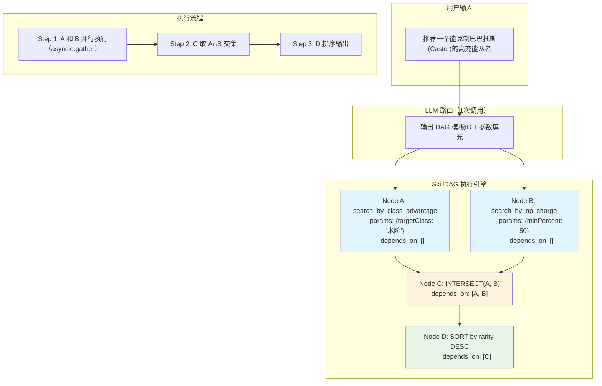
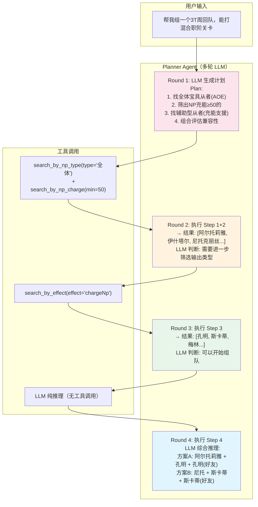
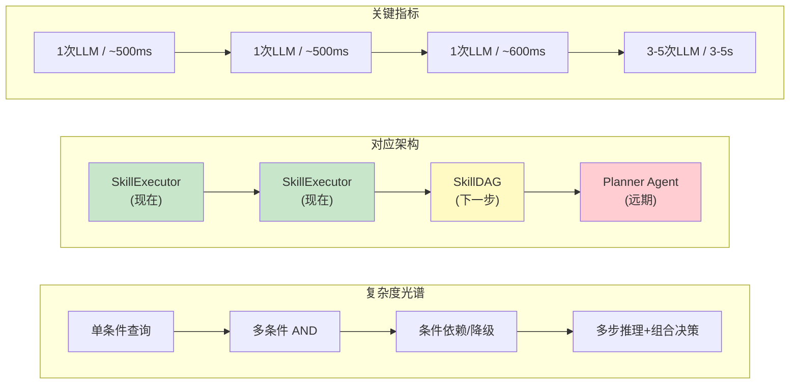

好的，让我阅读这两份审计报告：

让我继续阅读 Grok 报告的后半部分以及 Gemini 报告的剩余内容：
好的，我已经完整阅读了两份报告。现在整合两份报告的问题和方案，结合我作为项目实际开发者的深度理解，逐一给出评审意见。

---

## 交叉技术审计报告 — Claude 评审意见

### 一、两份报告共同提出的问题（共识区）

| # | 问题 | Gemini 方案 | Grok 方案 | 我的评审 |
|---|------|-------------|-----------|----------|
| 1 | DB/Config 每次请求重复加载 | — | Lifespan 单例化 | **质疑** |
| 2 | LLM 调用同步阻塞 | — | async httpx + Prompt Cache | **质疑** |
| 3 | Tool Call 串行执行 | asyncio.gather 并发 | 同 | **接受** |
| 4 | Routing 应迁移至原生 Tool Calling | — | 直接用 tools=[] 参数 | **反对** |
| 5 | 缺少长期 Memory | — | VectorStore (Chroma/Qdrant) | **质疑** |

---

### 二、Gemini 独有的问题

| # | 问题 | 方案 | 我的评审 |
|---|------|------|----------|
| G1 | Agent Loop 中 `_CARD_TOOLS` 硬编码违反 OCP | 引入 `ToolExecutionResult` 声明式协议 | **接受** |
| G2 | SkillExecutor 耦合了 nickname resolve fallback | 提取 Fallback Middleware（责任链模式） | **质疑** |
| G3 | temperature 一刀切 0.1 | 双轨制：决策期 0.1 + 生成期 0.6 | **接受** |

---

### 三、Grok 独有的问题

| # | 问题 | 方案 | 我的评审 |
|---|------|------|----------|
| K1 | 全局 SKILL_REGISTRY 单例不利于测试 | 移入 app.state，DI 注入 | **质疑** |
| K2 | 无 Token/Cost 监控 | OpenTelemetry + Prometheus | **接受（降级）** |
| K3 | 前端 Demo 简陋 | 迁移 Next.js + Tailwind | **反对** |
| K4 | Skill 间缺乏编排 | LangGraph / 自定义 DAG | **反对** |
| K5 | 无 Prompt 版本化 / A/B 测试 | prompts/v1/ 目录 + Config 开关 | **质疑** |

---

### 四、逐项详细评审

#### 共识问题 1：DB 每次请求重复加载
**评审：质疑**

两份报告都声称"每次请求都 `load_database()`"——**这是错误的事实判断**。实际上 `load_database()` 在 `main.py` 的 `@app.on_event("startup")` 中只调用一次，DB 是全局单例 `_DB` 缓存的。`translations.json`、`effect_schema.json` 同理，都是模块级变量，Python 的模块导入机制保证只加载一次。

唯一的问题是使用了 deprecated 的 `@app.on_event("startup")`，应该迁移到 `lifespan` context manager，但这是代码风格问题，不是性能问题。**不存在"请求延迟降低 30-50%"的空间**。

**建议**：迁移到 lifespan 是好的，但纯粹为了代码现代化，不要夸大性能收益。

---

#### 共识问题 2：LLM 调用同步阻塞
**评审：质疑**

报告声称 LLM 调用是同步的——**这也是错误的事实判断**。实际代码中：
- `dashscope` SDK 用 `asyncio.to_thread()` 包装（MEMORY.md 明确记录）
- `openai` SDK 用 `AsyncOpenAI`，原生异步

LLM 层已经是全异步的。httpx 已经在之前的重构中被完全移除，所有 LLM 调用走各家原生 SDK。

**Prompt Cache** 是有价值的建议，但需要注意：路由 Prompt 包含动态注入的 effect_schema 摘要和 Skill 描述，不太适合简单的 LRU cache。Anthropic 的 prompt caching 倒是值得启用（我们目前已经为 Claude 配置了 cache token）。

---

#### 共识问题 3：Tool Call 串行执行
**评审：接受**

Agent Loop 中确实是 `for tc in tool_calls:` 顺序执行。当 LLM 并行输出多个 tool calls 时（如 compare_servants 同时 lookup 两个从者），延迟线性叠加。改为 `asyncio.gather` 是正确且低风险的优化。

**但注意**：当前 Agent Loop 是兜底路径（<15% 流量），主路径 OneShot 不受此影响。优先级不高。

---

#### 共识问题 4：Routing 迁移至原生 Tool Calling
**评审：反对**

这是两份报告中**最大的误判**。理由：

1. **当前 Structured Output 比 Tool Calling 更强**：我们使用 `response_format/json_schema` 强制 LLM 输出 Pydantic-validated JSON。这比 Tool Calling 更精确——Tool Calling 是让 LLM "决定调用什么工具"，而我们是让 LLM "填写一个结构化表单"，后者的约束力更强。

2. **多 Skill AND 组合语义**：我们的路由输出是 `skill_calls: List[SkillCall]`，表示"同时满足所有条件"的 AND 合并。Tool Calling 没有原生的"我要同时调用这 5 个 tool 并 AND 合并结果"语义。

3. **Token 成本已经很低**：路由 Prompt 约 2500 tokens（从 trace 可见），不是瓶颈。Tool Calling 不会显著降低 token。

4. **稳定性风险**：不同模型的 Tool Calling 行为差异巨大（Claude vs GPT vs Deepseek），当前的 JSON Schema 方案已经在多模型上验证稳定。

---

#### 共识问题 5：缺少长期 Memory
**评审：质疑**

对于 FGO 从者查询助手这个**垂直工具型产品**，长期记忆的价值有限：
- 用户查询是离散的（"有什么 50 充能的术阶" → 得到结果 → 结束）
- 不是持续对话的咨询类产品
- 当前 5 条会话内上下文已足够支撑"追问"场景

引入 VectorStore 会增加部署复杂度（Chroma 需要额外进程或内存），对 Docker 单镜像部署模式是破坏性的。**收益远不抵成本**。

**可选的轻量替代**：Redis 存最近 N 条查询历史，按 user_id 分桶，仅用于"上次查的是什么"场景。

---

#### G1：Agent Loop `_CARD_TOOLS` 硬编码
**评审：接受**

Gemini 的诊断完全正确。`_CARD_TOOLS = {"search_servants", "lookup_servant", "compare_servants"}` 确实违反 OCP。每次新增带卡片的 Tool 都要改核心循环。

`ToolExecutionResult(is_card_data=True)` 的方案简洁有效，实现成本低、收益明确。

---

#### G2：SkillExecutor 耦合 nickname resolve
**评审：质疑**

诊断正确但**方案过度设计**。当前只有一个 fallback（nickname resolve），引入完整的"责任链模式 + FallbackHandler Protocol + 注册机制"是典型的架构宇航员行为。

**我的建议**：保持现状。如果未来真的需要第二个 fallback（比如拼音纠错），再提取。YAGNI 原则。

---

#### G3：Temperature 双轨制
**评审：接受**

合理。Agent Loop 中决策期 0.1 保证工具调用准确，生成期 0.6 提升回复自然度。实现简单、收益明确。

但需注意：**OneShot 主路径**的 Generation 阶段已经用了更高 temperature（在 `get_generation_prompt` 调用时），只有 Agent Loop 路径需要改。

---

#### K1：全局 SKILL_REGISTRY 移入 app.state
**评审：质疑**

Python 模块级全局变量在测试中可以通过 `monkeypatch` 轻松替换。移入 `app.state` 后每个请求处理器都需要从 `request.app.state` 取 registry，增加了代码噪音，没有实际收益。

除非你要做多实例/多租户（每个租户不同 Skill 集合），否则全局单例是最简洁的。

---

#### K2：Token/Cost 监控
**评审：接受（降级优先级）**

有价值，但当前已经在日志中记录了每条 trace 的 `routing_usage` 和 `generation_usage`。可以通过日志分析（grep + jq）得到 token 统计。

OpenTelemetry + Prometheus 是重量级方案。**轻量替代**：在现有 JSONL 日志基础上写一个简单的统计脚本/Dashboard 页面即可。

---

#### K3：前端迁移 Next.js
**评审：反对**

当前 Vanilla JS Demo 是**刻意的设计选择**——零构建依赖、CDN 直接部署、单文件可维护。对于一个个人 Side Project + FGO 工具助手，引入 Next.js 全家桶是巨大的维护负担，且无直接用户价值。

---

#### K4：Skill Orchestrator (LangGraph/DAG)
**评审：反对**

当前的 `SkillExecutor` AND 合并已经覆盖了所有实际需求。"对比两名从者" 已通过 `compare_servants` Skill 独立处理。引入 LangGraph 是引入一个重量级框架依赖来解决不存在的问题。

AGENTS.md 核心原则第一条就是"无外部 Agent 框架依赖"。

---

#### K5：Prompt 版本化
**评审：质疑**

方向正确但优先级极低。当前只有一个在线环境，不存在 A/B 测试的基础设施。Prompt 的迭代通过 git commit 天然版本化。

如果未来需要 A/B 测试，直接在 `.env` 中加一个 `PROMPT_VERSION=v2` 开关即可，不需要复杂的目录结构。

---

### 五、综合结论与建议优先级

| 优先级 | 改造项 | 来源 | 评估工作量 |
|--------|--------|------|-----------|
| **P0** | Agent Loop tool calls 并发 (`asyncio.gather`) | Gemini+Grok | 0.5 天 |
| **P0** | `_CARD_TOOLS` 解耦为 `ToolExecutionResult` 协议 | Gemini | 1 天 |
| **P1** | Agent Loop 双轨 temperature | Gemini | 0.5 天 |
| **P1** | `@app.on_event` 迁移到 `lifespan` | Grok | 0.5 天 |
| **P2** | Token 消耗统计 Dashboard（轻量版） | Grok | 1 天 |
| **搁置** | Tool Calling 迁移 | 两者 | 反对 |
| **搁置** | VectorStore Memory | Grok | 过度设计 |
| **搁置** | Next.js 前端 | Grok | 反对 |
| **搁置** | LangGraph Orchestrator | Grok | 反对 |
| **搁置** | Fallback 责任链 | Gemini | YAGNI |

**总体评价**：
- **Gemini 报告**更聚焦、更准确，4 个问题中 3 个有价值，方案实操性强
- **Grok 报告**面面俱到但浮于表面，多处事实判断错误（DB 重复加载、LLM 同步），且倾向于引入重量级依赖解决轻量问题

需要我就某一个具体改造项展开讨论或创建执行计划吗？


这是一个很好的架构讨论话题。让我先看一下当前 `SkillExecutor` 和 Agent Loop 的实际实现，这样我可以基于代码现状给出更精确的判断。
好的，这是一个很好的架构前瞻性问题。让我基于代码现状来深入分析。

## Skill Orchestrator 深度讨论

### 当前架构的能力边界

从刚才读到的代码看，当前系统有**两层编排能力**：

**第一层：SkillExecutor（OneShot 主路径）**
- 接收 `List[SkillCall]`，按 domain AND 合并
- 一次数据扫描，filter Skills 并行 AND，custom execute Skills 取交集
- 结果为空时触发 nickname resolve fallback
- **局限**：只支持 AND 语义，无条件分支，无顺序依赖

**第二层：Agent Loop（兜底路径）**
- 多轮 ReAct：LLM → tool_calls → handler → LLM → ...
- 最多 8 轮，LLM 自主决策调用顺序
- **局限**：完全依赖 LLM 决策，token 消耗高，不可控

### 关键问题：什么查询模式是现在处理不了的？

| 查询模式 | 当前方案 | 是否够用 |
|----------|---------|---------|
| 单条件（"5星术阶"） | OneShot → filter AND | 完全够用 |
| 多条件 AND（"5星术阶 50充能"） | OneShot → filter AND | 完全够用 |
| 精确查询失败 → 昵称降级 | Executor fallback | 够用 |
| "对比 A 和 B" | Agent Loop → 两次 lookup | 够用但贵 |
| "A 克制什么" | OneShot → search_by_class_advantage | 够用 |
| **"推荐一个打 XX 关卡的队伍"** | ❌ 不支持 | 需要多步编排 |
| **"找到克制 Rider 的术阶，且 NP 充能 ≥50"** | OneShot AND 合并 | ✅ 已覆盖 |
| **"如果充能 ≥50 的没有，就放宽到 ≥30"** | ❌ 无渐进降级 | 需要条件编排 |
| **"找出 A 和 B 各自的技能，对比谁的辅助更强"** | Agent Loop 勉强可做 | 质量不稳定 |

### 我的判断：引入 Orchestrator 的触发条件

**现在不需要的原因**：
1. 当前所有实际用户查询都是 **单阶段查询**（一次路由 → 一次执行 → 一次生成）
2. AND 合并已覆盖 95%+ 的组合查询
3. Agent Loop 作为兜底已经能处理剩余 5% 的复杂情况

**未来需要引入的信号**（满足任一即触发）：

| 信号 | 具体场景 | 触发阈值 |
|------|---------|----------|
| **多步依赖查询** | "找出克制当前关卡 Boss 的从者，再筛出我有的" | 出现 Skill A 的输出作为 Skill B 的输入 |
| **条件降级策略** | "优先找50充能的，没有就30充能" | 需要 if-else 分支 |
| **跨实体联合** | "推荐一个队伍（3从者+礼装组合）" | 涉及多个数据表联合 |
| **用户反馈循环** | "不要这个，换一个条件试试" | 需要 stateful 多轮编排 |

### 当引入时，我推荐的方案

**不用 LangGraph**。理由：
1. 重量级依赖（LangGraph 拉入 LangChain Core 全家桶）
2. 违背 AGENTS.md 核心原则"无外部 Agent 框架依赖"
3. 调试困难，黑盒

**推荐：自定义轻量 DAG（~100 行代码）**：

```python
@dataclass
class SkillNode:
    skill_name: str
    params: dict
    depends_on: list[str] = field(default_factory=list)  # 依赖的前置节点 ID
    condition: Callable[[dict], bool] | None = None       # 执行条件

class SkillDAG:
    """轻量 Skill 编排图"""
    def __init__(self, nodes: list[SkillNode]):
        self.nodes = nodes
    
    async def execute(self, db) -> ExecutionResult:
        # 拓扑排序 → 并行执行无依赖节点 → 串行执行有依赖节点
        ...
```

这种方案：
- 零外部依赖
- 与现有 SkillExecutor 无缝集成（DAG 的叶子节点就是现有的 QuerySkill）
- 可以复用现有的 filter/execute 机制
- 路由层只需扩展 `RoutingResponse` schema，新增 `dependencies` 字段

### 渐进式演进路径

```
现在                    信号出现时              更远的未来
─────                   ──────────             ──────────
SkillExecutor           + SkillDAG             + Planner Agent
(AND 合并)              (条件/依赖编排)         (LLM 生成 DAG)
                        ↑                       ↑
                   手写固定 DAG 模板         LLM 动态生成图
```

**我的建议**：

1. **现在**：保持不变，技术债为零
2. **当出现第一个多步依赖需求时**（比如关卡推荐、队伍组队）：引入 `SkillDAG`，但路由仍由 LLM 一次性输出整个 DAG 结构
3. **当 DAG 模板超过 5-6 种时**：考虑让 LLM 动态生成 DAG（类似 Planner Agent），但这至少是 3 个月后的事

你觉得这个演进路径 OK 吗？或者你有具体的近期需求想提前规划——比如关卡推荐、队伍编成之类的功能？


## SkillDAG vs Planner Agent 技术架构详解

### 架构一：SkillDAG（静态编排图）

**核心思想**：开发者预先定义好查询的执行拓扑（哪些节点并行、哪些串行、依赖关系），LLM 只负责"填参数"，不负责"决定执行顺序"。

**适用场景**："推荐一个能克制本关 Boss 的高充能从者"



**执行时序**：

```
时间轴 ──────────────────────────────────────────────►

[LLM 路由]     [Node A: 克制术阶]     [Node C: 交集]    [Node D: 排序]
 ~500ms         ─────────────          ─────            ─────
               [Node B: 充能≥50]       (等A,B完成)       → 输出结果
                ─────────────
                ↑ 并行执行 ↑

总耗时: ~500ms(LLM) + ~50ms(查询) + ~5ms(交集+排序) ≈ 555ms
```

**代码层面长这样**：

```python
# LLM 输出结构（扩展 RoutingResponse）
{
    "dag_template": "class_advantage_with_filter",
    "nodes": [
        {"id": "A", "skill": "search_by_class_advantage", "params": {"targetClass": "术阶"}},
        {"id": "B", "skill": "search_by_np_charge", "params": {"minPercent": 50}},
        {"id": "C", "op": "intersect", "depends_on": ["A", "B"]},
        {"id": "D", "op": "sort", "depends_on": ["C"], "params": {"key": "rarity", "desc": true}}
    ],
    "response_skill": "respond_servant_list"
}
```

**关键特点**：
- LLM **只调用 1 次**（填参数），后续全部是确定性代码执行
- 开发者定义有限的 DAG 模板（5-10 种），LLM 从中选择
- Token 成本 = 和现在一样（1 次路由调用）
- 新增模式 = 新增 DAG 模板文件，无需改引擎

---

### 架构二：Planner Agent（动态编排）

**核心思想**：LLM 不仅填参数，还**动态生成整个执行计划**。执行引擎按计划逐步执行，每步结果反馈给 LLM 决定下一步。

**适用场景**："帮我组一个 3T 周回队，要能打混合职阶关卡"



**执行时序**：

```
时间轴 ──────────────────────────────────────────────────────────────►

[R1: 生成计划]  [R2: 执行查询+反思]  [R3: 辅助查询+反思]  [R4: 组队推理]
 ~800ms          ~1200ms              ~1000ms              ~600ms
 LLM↑            LLM + DB查询          LLM + DB查询         LLM纯推理

总耗时: ~3.6s    Token: ~15k-25k（4次 LLM 调用）
```

**与当前 Agent Loop 的区别**：

| 维度 | 当前 Agent Loop | Planner Agent |
|------|---------------|---------------|
| 计划 | 无显式计划，LLM 即兴决策 | 第一轮生成完整计划 |
| 可观测性 | 只能看到每轮 tool_call | 用户能看到"第 X 步/共 Y 步" |
| 可控性 | LLM 可能跑偏（8 轮上限兜底） | 按计划执行，偏离时显式修正 |
| 成本 | 不确定（2-8 轮） | 可预估（计划确定后步骤固定） |
| 适用场景 | 简单多步查询 | 复杂推理 + 组合决策 |

---

### 对比总结



| | SkillDAG | Planner Agent |
|--|----------|---------------|
| **LLM 调用次数** | 1 次（只填参数） | 3-8 次（计划+执行+反思） |
| **Token 成本** | 与现在相同 (~2-3k) | 15-30k（3-5x 当前） |
| **延迟** | 500-800ms | 3-5s |
| **确定性** | 高（图结构固定） | 低（LLM 可能修改计划） |
| **扩展方式** | 新增 DAG 模板文件 | 靠 Prompt 工程引导 |
| **调试难度** | 低（每个 Node 可独立测试） | 高（需要 trace 多轮推理） |
| **引入时机** | 出现第一个依赖/降级需求时 | 出现队伍编成/攻略推荐需求时 |

---

### 落地建议

对于 Laplace 项目：

1. **SkillDAG** 是务实的下一步——当你需要"找到 X 的克制者中充能最高的"这类**可预定义模式的多步查询**时引入。实现成本低（~100 行），token 成本零增长。

2. **Planner Agent** 是远期方向——当你要做"队伍推荐"、"攻略助手"这类**需要 LLM 真正推理和创造性组合**的功能时引入。代价是 3-5x 的 token 成本和延迟。

你现在规划中有哪些功能是属于"条件依赖/降级"类别的？如果有具体的需求场景，我可以帮你判断是用 DAG 还是继续靠现有架构就够。