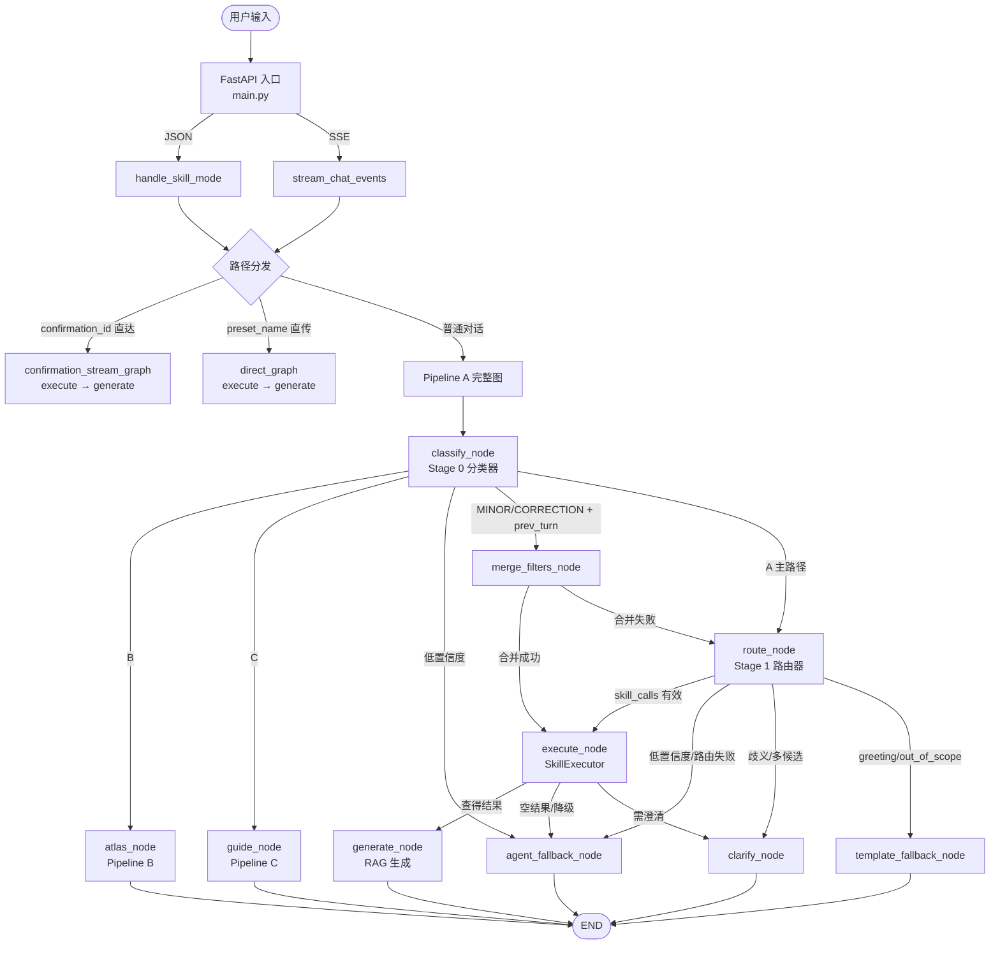
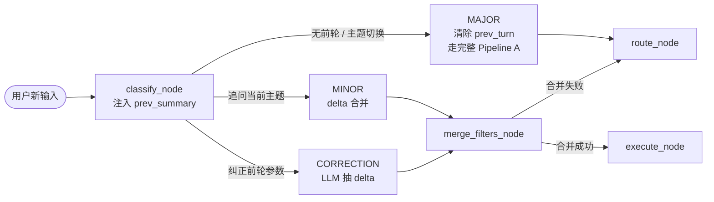

# Laplace 项目架构文档

> 本文档完全基于源代码分析生成，最后更新：2026-06-12 · 版本 **v0.5.0**

## 1. 项目概览

Laplace 是一个 FGO（Fate/Grand Order）游戏助手，以自然语言问答为核心交互方式。用户输入自然语言查询，系统通过 LLM 路由到合适的技能模块，执行结构化数据库查询或攻略检索，最终生成面向玩家的中文回复。

**技术栈**：Python 3.12 / FastAPI / SSE / BM25 / SQLite (Checkpointer) / 多 LLM 供应商（OpenAI / Obao / Dashscope）

**核心设计理念**：
- **声明式 DAG 图引擎**（v0.5.0 起，参见 [ADR-028](adr/ADR-028-declarative-pipeline-migration.md)）：所有请求处理拆为节点 + 条件边，集中式拓扑声明替代命令式 if/else 长链路
- **节点 = 异步纯函数 `State → State`**，流式节点为 async generator；条件边集中在 [server/edges.py](../server/edges.py) 便于单测
- **多轮对话状态**：`SessionStore` + `SqliteCheckpointer` 支持 MAJOR / MINOR / CORRECTION 三类后续轮次
- **SSE 节点级实时**：`StateGraph.run_stream` 把节点产出的事件实时透传到前端，普通节点通过 `state.pending_events` 缓冲
- 两阶段 LLM 路由（分类器 → 技能路由器），而非端到端生成
- 结构化数据查询优先，LLM 仅负责理解意图和生成回复
- 所有英文枚举在构建时预翻译为中文，运行时零翻译开销
- 多供应商 LLM 容灾，两层降级（同供应商备选模型 → 跨供应商降级）

---

## 2. 系统架构总览

v0.5.0 起，所有请求处理统一通过 [StateGraph](../server/graph/engine.py) 推进。下图为 Pipeline A 完整图（含降级分支）：



**降级 reason 分发**（集中在 [edges._dispatch_bail_out](../server/edges.py)）：

| `state.extras["bail_out"]` reason | 分发节点 |
|:---|:---|
| `low_confidence_agent` / `routing_failed` / `fallback_no_match` / `fallback_ambiguous` / `empty_skill_calls` / `execution_fallback` | `agent_fallback` |
| `clarification` / `execution_clarification` | `clarify` |
| `fallback_greeting` / `fallback_out_of_scope` | `template_fallback` |
| 未知 reason | `agent_fallback`（保底兜底） |

---

## 3. 入口层（`server/main.py`，545 行）

### 3.1 FastAPI 应用配置

- **中间件**：CORS（允许所有来源）+ 自定义速率限制
- **启动流程**（`@app.on_event("startup")`）：
  1. `load_database()` — 加载从者/CE/效果数据库
  2. `validate_translations()` — 校验翻译完整性
  3. `validate_skill_registry()` — 校验技能注册表一致性
  4. `start_probe_loop()` — 启动 LLM 模型健康探测

### 3.2 API 路由

| 路由 | 方法 | 说明 |
|:---|:---|:---|
| `/chat` | POST | JSON 模式请求，返回完整响应 |
| `/chat/stream` | POST | SSE 流式请求，逐步返回事件 |
| `/presets` | GET | 获取预设列表 |
| `/admin/config/{name}` | GET/PUT | 配置文件读写 |
| `/admin/env` | GET/PUT | 环境变量管理 |
| `/admin/logs` | GET | 日志查询 |
| `/admin/metrics` | GET | Prometheus 指标 |
| `/admin/health` | GET | 健康检查 |
| `/faces/{servant_id}` | GET | 从者头像代理 |

### 3.3 请求模型

```python
class ChatRequest:
    message: str              # 用户输入
    mode: str = "skill"       # 固定为 "skill"
    preset_name: str | None   # 预设名称
    params: dict | None       # 预设参数
    response_skill: str | None  # 指定回复技能
    confirmation_context: dict | None  # 确认上下文（跳过路由）
```

**B1 合并策略**：当同时有 `preset_name` 和 `message` 时，将预设文本与用户文本合并为组合查询。

---

## 4. DAG 图引擎与节点拓扑（v0.5.0 起）

> 自 v0.5.0 起，三管线（A/B/C）的所有路由、执行、降级逻辑统一收敛到 [server/graph/](../server/graph/) + [server/nodes/](../server/nodes/)，[server/pipeline.py](../server/pipeline.py) 从 2329 行精简至 ~970 行，仅保留图构建器 + JSON/SSE 入口分发。

### 4.1 图引擎核心（`server/graph/engine.py`）

[StateGraph](../server/graph/engine.py) ~280 行实现，零外部依赖。核心 API：

| 方法 | 签名 | 说明 |
|:---|:---|:---|
| `add_node` | `(name, async fn(state) -> state)` | 注册普通节点 |
| `add_stream_node` | `(name, async generator fn(state))` | 注册流式节点（yield 事件 dict） |
| `add_edge` | `(from, to)` | 静态边 |
| `add_conditional_edge` | `(from, router(state) -> str)` | 条件边（路由函数集中在 `edges.py`） |
| `set_entry` | `(name)` | 设置入口节点 |
| `run(state)` | → state | 同步执行（流式节点的事件被消费但不转发） |
| `run_stream(state)` | → AsyncGenerator[dict] | 流式执行（实时 yield 事件 dict） |
| `resume(state, from_node, ...)` | → state | 从 checkpoint 恢复（Task 4 多轮对话用） |

**事件契约**：流式节点 yield `{"type": "thinking"|"servants"|..., "data": {...}}`；非事件 yield 视为新 state。引擎 hard cap `MAX_HOPS=50` 防止死循环。

### 4.2 节点目录（`server/nodes/`）

| 节点 | 类型 | 职责 |
|:---|:---|:---|
| [classify_node](../server/nodes/classify.py) | 普通 | Stage 0 三路分类器（A/B/C），多轮场景注入 `prev_summary` 输出 `turn_type` |
| [route_node](../server/nodes/route.py) | 普通 | Stage 1 LLM 技能路由器（`build_routing_prompt` + Pydantic 校验） |
| [merge_filters_node](../server/nodes/merge_filters.py) | 普通 | MINOR / CORRECTION 多轮 delta 合并（4 种粒度，详见 §5） |
| [execute_node](../server/nodes/execute.py) | 普通 | `SkillExecutor` 域分组 AND 合并 + 排序 |
| [generate_node](../server/nodes/generate.py) | 普通 + 流式 | RAG 生成（`generate_stream_node` 逐 token yield delta） |
| [atlas_node](../server/nodes/atlas.py) | 普通 + 流式 | Pipeline B Agent 循环（最多 8 轮工具调用 + 事实核验） |
| [guide_node](../server/nodes/guide.py) | 普通 + 流式 | Pipeline C BM25 攻略检索 + LLM 生成 |
| [agent_fallback_node](../server/nodes/agent.py) | 普通 + 流式 | 4 处旧 Agent 兜底合 1（routing 失败 / 空结果 / 低置信度等） |
| [clarify_node](../server/nodes/clarify.py) | 普通 | 歧义/多候选澄清（yield `clarification` / `pending_question` 事件） |
| [template_fallback_node](../server/nodes/fallback.py) | 普通 | greeting / out_of_scope 模板回复（不调 LLM） |

### 4.3 条件边（`server/edges.py`）

集中存放所有路由判断函数，**纯函数 + 无 IO**，便于单测：

```python
after_classify(state) -> "atlas" | "guide" | "merge_filters" | "route" | "agent_fallback"
after_merge_filters(state) -> "execute" | "route"           # 合并失败降级到 route
after_route(state) -> "execute" | "agent_fallback" | "clarify" | "template_fallback"
after_execute(state) -> "generate" | "agent_fallback" | "clarify"
```

降级 reason 通过 `_dispatch_bail_out(reason)` 单点分发到 agent / clarify / template_fallback 三类节点，未知 reason 兜底到 `agent_fallback`。

### 4.4 图实例与缓存

[pipeline.py](../server/pipeline.py) 暴露 6 个图实例（模块级缓存避免每请求重建）：

| 图 | 用途 | 入口 |
|:---|:---|:---|
| `_PIPELINE_A_GRAPH` | JSON 完整 A 图（10 节点） | `classify` |
| `_PIPELINE_DIRECT_GRAPH` | preset / 前端直传短图 | `execute` |
| `_PIPELINE_B_GRAPH` / `_PIPELINE_C_GRAPH` | 单节点图（B/C wrapper，供测试） | `atlas` / `guide` |
| `_PIPELINE_A_STREAM_GRAPH` | SSE 完整 A 流式图 | `classify` |
| `_PIPELINE_DIRECT_STREAM_GRAPH` | SSE preset 直传流式短图 | `execute` |
| `_PIPELINE_CONFIRMATION_STREAM_GRAPH` | SSE confirmation_id 直达流式短图（仅 generate_stream） | `generate` |

---

## 5. 多轮对话与 SessionStore（v0.5.0 Task 4）

### 5.1 turn_type 三类后续轮次

[server/schemas.py::ClassifierResponse](../server/schemas.py) 新增 `turn_type` 字段，由分类器在注入 `prev_summary`（≤200 char）后输出：



### 5.2 MINOR 4 种粒度（`merge_filters_node`）

| 粒度 | 例子 | 操作 |
|:---|:---|:---|
| G1 复用管线 | "再帮我看看宝具效果" | 复用 prev `skill_calls`，仅切换 response_skill |
| G2 追加过滤 | "其中弓阶的" | prev `skill_calls` ∪ 新增 `search_by_class` |
| G3 切换 response_skill | "详细说说" | 复用查询结果，response_skill → `respond_servant_detail` |
| G4 CORRECTION 修正参数 | "我说的是 Alter 版" | LLM 抽 delta，修正 `lookup_servant.name` |

合并失败 → `bail_out="merge_failed_fallback_route"` → `after_merge_filters` 把状态重置为 MAJOR 重新走 `route`。

### 5.3 SessionStore + Checkpointer

- [SessionStore](../server/graph/session.py)：内存维护 `session_id → TurnSnapshot`（最近一轮的 `skill_calls / servants / response_skill / summary`）
- [SqliteCheckpointer](../server/graph/checkpointer.py)：WAL 模式落 `server/data/checkpoints.db`，30 分钟 TTL 应用层清理；序列化 PipelineState 全字段
- [InMemoryCheckpointer](../server/graph/checkpointer.py)：测试用，相同 `Checkpointer` Protocol

**系统主动中断**：路由置信度低 / 特性识别失败 / 多候选歧义时，[clarify_node](../server/nodes/clarify.py) yield `pending_question` 事件并保存 checkpoint；用户答复后通过 `resume_skill_mode` / `engine.resume()` 从 `from_node` 恢复。

---

## 6. SSE 流式统一（v0.5.0 Task 5）

### 6.1 入口与三路径分发

[stream_chat_events](../server/pipeline.py) 是唯一 SSE 入口，按优先级分发到三套流式图：

```mermaid
flowchart TD
    Req[/api/chat/stream] --> Entry[stream_chat_events]
    Entry --> Check{参数判断}
    Check -->|confirmation_id 是数字| P1[confirmation_stream_graph<br/>预填 ExecutionResult<br/>跳过 SkillExecutor]
    Check -->|preset_name 非空| P2[direct_stream_graph<br/>preset 展开 + B1 LLM 补充]
    Check -->|普通对话| P3[a_stream_graph<br/>完整 Pipeline A]
    P1 --> Done[done 事件 + 写 SessionStore]
    P2 --> Done
    P3 --> Done
```

### 6.2 节点级实时事件转发

[StateGraph.run_stream](../server/graph/engine.py) 的核心改造：

- **流式节点**（`async generator`）：yield 的事件 dict 实时透传给上层，不必等节点结束
- **普通节点**：把中间事件 append 到 `state.pending_events`，节点结束后引擎统一 flush 并清空缓冲区
- **state.extras["streaming"] 标志**：节点据此决定是否生成事件（避免 JSON 模式重复执行）

### 6.3 6 种 SSE 事件契约

| 事件类型 | 触发节点 | 说明 |
|:---|:---|:---|
| `thinking` | classify / route / execute / merge_filters | 分阶段思考过程（中文化展示） |
| `servants` | execute / atlas | 从者/CE 卡片数据先行渲染 |
| `clarification` | clarify | 歧义场景的候选选项 |
| `pending_question` | clarify | 系统主动中断的补充询问（带 checkpoint） |
| `delta` | generate_stream / atlas_stream / guide_stream / agent_fallback_stream | LLM 逐 token 文本增量 |
| `done` | 引擎收尾 | 终态信号（含 model / traceId / needs_confirmation 等） |
| `error` | 异常捕获 | 服务异常兜底 |

---

## 7. 技能系统（`server/skills/`）

### 5.1 基础架构（`base.py`）

```python
class QuerySkill(BaseSkill):
    domain: str           # "servant" | "ce" | "knowledge"
    params_schema: dict   # 参数 JSON Schema
    def filter(params, db) -> list     # 过滤数据库
    def execute(params, db) -> Result  # 执行查询

class ResponseSkill(BaseSkill):
    def build_prompt(context, query) -> str  # 构建生成 prompt

SKILL_REGISTRY: dict[str, BaseSkill]  # 全局技能注册表
@register_skill(name)                 # 注册装饰器
```

### 5.2 查询技能（19 个）

**从者域（14 个）**：

| 技能 | 功能 | 关键实现细节 |
|:---|:---|:---|
| `lookup_servant` | 按名字查从者 | 三阶段匹配：精确 → 模糊 → 昵称 |
| `compare_servants` | 比较多个从者 | 支持 2-5 个从者对比 |
| `resolve_nickname` | 昵称解析 | 同步缓存 + 异步 LLM 猜测 |
| `search_by_effect` | 按技能效果搜索 | 复合效果、CD 匹配、值转换 |
| `search_by_class` | 按职阶搜索 | — |
| `search_by_rarity` | 按稀有度搜索 | — |
| `search_by_cards` | 按指令卡搜索 | — |
| `search_by_traits` | 按特性搜索 | trait 别名解析、阵营拆分 |
| `search_by_attribute` | 按属性搜索 | — |
| `search_by_class_advantage` | 按克制关系搜索 | — |
| `search_by_skill_effect` | 按主动技能效果搜索 | — |
| `search_by_np_effect` | 按宝具效果搜索 | — |
| `coronation_knowledge` | 戴冠战知识 | — |
| `coronation_team` | 戴冠战配队 | — |

**概念礼装域（5 个）**：

| 技能 | 功能 |
|:---|:---|
| `ce_lookup` | 按名字查 CE |
| `ce_search_by_effect` | 按效果搜索 CE |
| `ce_search_by_rarity` | 按稀有度搜索 CE |
| `ce_search_by_atk_type` | 按攻/HP 类型搜索 CE |
| `ce_search_by_obtain` | 按获取方式搜索 CE |

### 5.3 回复技能（6 个）

| 技能 | 功能 | 特殊逻辑 |
|:---|:---|:---|
| `respond_servant_list` | 从者列表回复 | — |
| `respond_servant_detail` | 从者详情回复 | 含技能/宝具详细数据 |
| `respond_servant_compare` | 从者对比回复 | 多维度对比表 |
| `respond_support_analysis` | 辅助推荐回复 | — |
| `respond_coronation` | 戴冠攻略回复 | 800 字符限制 |
| `respond_ce_list` | CE 列表回复 | — |

### 5.4 技能执行器（`executor.py`）

**执行流程**：
1. 按域（servant/ce/knowledge）分组 SkillCall
2. 同域多技能使用 AND 合并过滤条件
3. 查询数据库获取结果

**四级降级机制**：
1. **主查询失败** → 放宽过滤条件（relaxation suggestions）
2. **名字未匹配** → 昵称解析（`resolve_nickname`）
3. **昵称解析失败** → LLM 候选猜测
4. **仍无结果** → Agent 工具调用循环兜底

**澄清类型**（`ClarificationRequest`）：
- `multi_candidate` — 多个候选从者，需用户选择
- `empty_result_name` — 名字未匹配
- `empty_result_filter` — 条件过滤后无结果

### 5.5 预设系统（`presets.py`）

4 个预设模板，将常见查询模式封装为一键操作：

| 预设 | 映射技能 |
|:---|:---|
| `cycle_farming` | search_by_effect + respond_servant_list |
| `servant_lookup` | lookup_servant + respond_servant_detail |
| `servant_compare` | compare_servants + respond_servant_compare |
| `support_recommend` | search_by_effect + respond_support_analysis |

---

## 8. LLM 适配层（`server/llm/`）

### 6.1 基础抽象（`base.py`）

```python
class BaseLLMAdapter(ABC):
    async def chat_completion(messages, json_mode, json_schema) -> str
    async def agent_completion(messages, tools) -> AgentResponse
    async def chat_completion_stream(messages) -> AsyncIterator[str]
```

**重试机制**：`_retry_loop()`，MAX_RETRIES=3，退避间隔 [1.0, 2.0, 4.0] 秒。

**JSON 提取**：`extract_json_object()` 从 LLM 回复中提取 JSON（处理 markdown 代码块等）。

### 6.2 供应商管理（`provider.py`）

**配置方式**：
- **新格式**：`LLM_PROVIDERS=name1,name2` + 每个供应商独立 `{NAME}_URL`/`{NAME}_KEY`/`{NAME}_MODELS`
- **旧格式**：单一 `LLM_BASE_URL`/`LLM_API_KEY`/`LLM_MODEL`

**两层降级**：
1. 同供应商内多模型轮转
2. 跨供应商降级（provider A 全部不可用 → provider B）

**错误分类**（`_classify_llm_error()`）：
- `rate_limit` — 429 限流
- `timeout` — 请求超时
- `auth` — 401/403 认证失败
- `bad_request` — 400 请求格式错误
- `server` — 5xx 服务端错误
- `unknown` — 未知错误

**跨供应商兼容**：`_sanitize_tool_messages()` 处理不同 API 的 tool message 格式差异。

### 6.3 适配器实现

| 适配器 | API 协议 | JSON 降级策略 |
|:---|:---|:---|
| `OpenAIAdapter` | Responses API（chat）/ Chat Completions（agent） | json_schema(strict=True) → text_fallback |
| `ObaoAdapter` | Chat Completions API | json_schema(strict=False) → json_object → text_fallback |
| `DashscopeAdapter` | 同步 SDK + asyncio.to_thread() | json_object → text_fallback |

---

## 9. Agent 系统（`server/agent/`）

### 7.1 Agent 循环（`agent_loop.py`）

```python
async def agent_route(query, db, llm, max_rounds=8) -> AgentResult
```

- 每轮：LLM 决策 → 工具调用 → 结果注入 → 下一轮
- `AgentResult` 包含文本回复 + 可选的卡片渲染数据（`_CARD_TOOLS`）
- `oneshot_context` 注入防止重复工具调用

### 7.2 工具定义（`tool_defs.py`，7 个工具）

| 工具 | 参数数量 | 说明 |
|:---|:---|:---|
| `search_servants` | 15 | 多条件组合搜索从者 |
| `lookup_servant` | 1 | 按名字查找从者详情 |
| `compare_servants` | 1 | 对比多个从者 |
| `list_effects` | 0 | 列出所有可搜索效果 |
| `list_traits` | 0 | 列出所有特性 |
| `list_classes` | 0 | 列出所有职阶 |
| `lookup_skill_detail` | 1 | 调用 Atlas Academy API 查技能详情 |

### 7.3 工具处理器（`tool_handlers.py`）

- `handle_search_servants`：将 15 个参数映射为最多 7 个 SkillCall
- `handle_lookup_skill_detail`：唯一调用外部 API（Atlas Academy）的工具
- `TOOL_HANDLERS` 字典注册所有处理函数

### 7.4 Agent Prompt（`agent_prompt.py`）

- 10 条工具使用准则
- 分类标签：`[GREETING]`/`[OUT_OF_SCOPE]`/`[UNSUPPORTED]`
- fallback.py 解析这些标签并返回模板消息

---

## 10. 数据构建层

### 8.1 主数据加载（`server/data_loader.py`，1757 行）

**数据源**：Atlas Academy API（`api.atlasacademy.io`）

**构建流程**：
```
Atlas API → 原始数据 → 效果匹配 → 翻译注入 → 物化视图 → 序列化 JSON
```

**核心机制**：

1. **声明式效果匹配**：从 Chaldea Dart 源码提取的验证规则，支持 6 种验证类型
   - `check_buff` — Buff 类型匹配
   - `check_func` — 函数类型匹配
   - `check_trait` — 特性 trait 匹配
   - `check_vals` — 数值范围匹配
   - `check_team` — 队伍目标匹配
   - `lambda` — 自定义验证逻辑

2. **三层 Trait 解析**：
   - Atlas 原始 trait → Chaldea 中文翻译 → 自定义别名

3. **物化视图**（构建时计算，运行时直接查询）：
   - `skillEffects` — 主动技能效果列表
   - `npEffects` — 宝具效果列表
   - `totalSelfCharge` — 自充能总量

4. **预消化（Pre-Digestion）**：所有英文枚举值在构建时翻译为中文，运行时零翻译开销

5. **partyOther 重分类**：FGO 特有的 buff 语义优化，根据 `funcTargetType` 将 `partyOther` 效果重分类为对自身或对队友

6. **CE entryFunction 机制**：概念礼装的初始效果提取

### 8.2 Schema 同步（`server/sync_chaldea.py`，752 行）

**数据源**：Chaldea App Dart 源码（GitHub）

**同步内容**：
- `FuncType`（130 个枚举值）
- `BuffType`（246 个枚举值）
- `SvtClass`（78 个枚举值）
- `SkillEffect` 定义与验证规则
- 多语言翻译（日/中/英/韩）

**输出**：`server/knowledge/` 目录下的 JSON 文件

### 8.3 昵称同步（`extractor/sync_mooncell_nicknames.py`，358 行）

**数据源**：Mooncell Wiki（fgo.wiki）MediaWiki API

**流程**：
```
枚举从者分类页面 → 批量获取 wikitext → 正则提取昵称/序号 → collectionNo 映射 → 写入 JSON
```

**输出**：`server/config/mooncell_nicknames.json`

### 8.4 数据文件结构

```
server/
├── data/
│   ├── servants_db.json          # 从者数据库（Atlas 构建）
│   ├── ce_db.json                # 概念礼装数据库
│   ├── atlas_cn_index.json       # Atlas 中文索引
│   └── guides/                   # 攻略文档（Pipeline C）
│       ├── coronation_general.md
│       ├── coronation_saber.md
│       └── coronation_berserker.md
├── config/
│   ├── nicknames.json            # 手工昵称表（优先级最高）
│   ├── mooncell_nicknames.json   # Mooncell 昵称表（自动生成）
│   ├── effect_hints.json         # 效果别名提示
│   └── trait_aliases.json        # 特性别名
└── knowledge/
    ├── func_type.json            # FuncType 枚举
    ├── buff_type.json            # BuffType 枚举
    ├── svt_class.json            # SvtClass 枚举
    ├── skill_effect.json         # SkillEffect 定义
    └── translations/             # 多语言翻译
```

---

## 11. 查询执行与上下文构建

### 9.1 查询执行器（`server/query_executor.py`，366 行）

- `load_database()` — 加载从者/CE/效果数据
- `load_nicknames()` — 两层昵称加载（mooncell 基础层 + 手工覆盖层，通过 `CachedConfig` 热加载）
- `_match_effect()` / `_match_np_effect()` — 效果匹配，含 partyOther 重分类
- `_normalize_text()` — 全角字符转半角 + 大小写归一化

### 9.2 上下文构建器（`server/context_builder.py`，366 行）

- `MAX_CONTEXT_SIZE = 5`（详情模式上限）
- `MAX_RESULTS = 50`（列表模式上限）
- `build_context()` — 构建从者上下文文本，detail 模式包含技能/宝具详细数据
- `build_ce_context()` — 构建 CE 上下文
- `format_effect_detail()` — 效果值的单位转换（如千分比→百分比）

### 9.3 翻译层（`server/translation.py`，231 行）

- `get_class_map()` — 职阶中英映射
- `get_effect_translation()` — 效果翻译
- `effect_qualifier()` — 效果修饰符
- `describe_filters()` — 将过滤条件翻译为中文描述（支持 20+ 技能类型）

---

## 12. 攻略检索引擎（`server/guide_retriever.py`，176 行）

**架构**：方案 D — 文档级 BM25 + 全文传入（参见 `docs/architecture-discussions/guide-retrieval-strategy-evolution.md`）

### 10.1 核心组件

- `GuideChunk` — 文档块，含内容、元数据、分数
- `GuideRetriever` — 检索引擎主类

### 10.2 索引构建

1. 加载 `server/data/guides/*.md`
2. 解析 YAML frontmatter（title/tags/author/updated）
3. 按 `##` 标题切分文档为 chunk
4. 中文 bigram 分词 + BM25Okapi 索引

### 10.3 检索策略

1. **文档级评分**：同一文档所有 chunk 取 max 分数作为文档分数
2. **Tag 过滤**：Stage 0 分类器提取的 tags 用于预筛选
3. **通用文档自动补召**：命中文档的同系列 "通用" 标签文档自动拉入
4. **全文传入**：返回命中文档的所有 chunk（而非 top_k 个 chunk）
5. **向量兜底**：`_vector_search()` 接口已预留，当前返回空（一期）

### 10.4 分词器

```python
# 简易中文分词：连续中文 + 英文单词 + 中文 bigram 扩展
tokens = re.findall(r"[\u4e00-\u9fff]+|[a-zA-Z0-9]+", text.lower())
# 长中文串额外做 bigram 切分以提升召回
```

---

## 13. 前端

### 11.1 Demo 前端（`demo/`）

**技术栈**：纯 HTML/CSS/JS，无框架依赖

#### `demo/app.js`（1385 行）

**SSE 通信**：通过 `ReadableStream` 处理 SSE 事件流，60 秒超时。

**核心功能**：
- **消息渲染**：支持从者卡片（含头像、职阶、稀有度边框）、CE 卡片、文本回复
- **思考动画**：thinking 事件触发带动画图标的思考步骤展示
- **澄清流程**：`sendWithConfirmation()` 处理多候选选择
- **会话管理**：localStorage 存储，最多 20 个会话
- **评价系统**：每条回复可评分
- **调试面板**：Ctrl+D 切换，显示路由/技能调用/Token 使用详情
- **数据分析**：`sendBeacon` 上报用户行为

#### `demo/style.css`（1601 行）

- **主题**：深色主题（`#0a0b1a` 背景），金/紫/青强调色
- **字体**：Noto Sans SC + Orbitron
- **响应式**：4 个断点（768/480/360px）
- **卡片样式**：稀有度决定边框颜色（5星金、4星紫、3星蓝、2星绿、1星灰）
- **动画**：骨架屏加载、脉冲、渐变等

#### `demo/changelog.js`（前端更新日志模块）

#### `demo/logs.js`（前端日志查看模块）

### 11.2 Admin 后台（`admin/`）

**技术栈**：纯 HTML/CSS/JS

#### `admin/admin.js`（427 行）

**三个 Tab 页**：

1. **环境变量管理**：支持文件模式（`.env`）和环境注入模式，在线编辑环境变量
2. **配置文件管理**：JSON 配置文件的在线编辑，含 JSON 语法校验
3. **监控面板**：LLM 指标（请求量/延迟/成功率）、模型可用性状态、30 秒自动刷新

#### `admin/auth.py`（Admin 认证模块）

基于 API Key 的简单认证，Key 来自 `ADMIN_API_KEY` 环境变量。

#### `admin/routes.py`（Admin 路由注册）

注册所有 `/admin/*` 路由到 FastAPI 应用。

---

## 14. 监控与基础设施

### 12.1 日志系统（`server/logger.py`）

- **格式**：JSONL 结构化日志，按北京时间天分文件 `query_trace.YYYY-MM-DD.jsonl`（v0.5.1 起）；legacy 单文件 `query_trace.jsonl` 保留为只读 fallback
- **30+ 种 Phase 类型**（`Phase` 类常量 + `PHASES` frozenset）：覆盖完整请求生命周期，单测强制约束
- **trace_id 协程级自动传播**：`current_trace_id` ContextVar + `bind_trace_id()` / `get_trace_id()`，告别显式参数透传（详见 [ADR-029](adr/ADR-029-trace-contextvar.md)）
- **跨文件读取**：`_iter_log_files()` 统一遍历当天 + 历史 + legacy
- **CLI 工具**：`python -m server.logger cleanup --keep-days 30`
- `find_trace(trace_id)` — 按 trace ID 聚合日志
- `compute_log_stats()` — 走 SQLite SQL group by（v0.5.1 起，见 12.6）

### 12.2 BI 索引层（`server/bi_index.py`，v0.5.1 新增）

- **双层存储**：JSONL 是事实源，SQLite (`server/logs/bi_index.sqlite`) 是 final 事件派生索引（详见 [ADR-030](adr/ADR-030-bi-sqlite-index.md)）
- **表 `turn_summary`**：trace_id PK + ts / session_id / turn_type / pipeline / skill_names / clarification_type / error_reason / latency_ms / total_tokens / rating / model / query_hash / query_preview
- **索引**：`(ts)` / `(pipeline, turn_type)` / `(error_reason)` / `(session_id, ts)`
- **API**：`upsert_turn(event)`（final 事件触发，try/except 容错不阻塞 JSONL）、`query_stats(filters)`、`reindex_from_jsonl()`
- **CLI**：`python -m server.bi_index reindex` 全量重建

### 12.3 with_trace 装饰器（`server/graph/decorators.py`）

- 11 节点统一接入 `@with_trace("<phase>")`（v0.5.1 起）
- 自动埋 input/output/error 三事件，统一 schema：`node_name` / `state_summary` / `latency_ms` / `result` / `metric_labels` 切片
- 出口同步调 `record_node_latency(node_name, result, latency_ms)`

### 12.4 速率限制（`server/rate_limiter.py`，132 行）

- **双层限制**：per-IP + 全局
- **滑动窗口**：60 秒清理周期
- **IP 提取**：支持 `X-Forwarded-For` 头

### 12.5 指标收集（`server/monitor/metrics.py`）

- `MetricsCollector` — 60 分钟环形缓冲区（LLM 维度）
- **业务维度指标**（v0.5.1 起）：
  - `laplace_pipeline_requests_total{pipeline, turn_type, status}`
  - `laplace_skill_calls_total{skill_name, domain, status}` —— skill_name 受控于 SKILL_REGISTRY
  - `laplace_node_latency_seconds_bucket{node_name, result}` —— Histogram
  - `laplace_clarifications_total{clarification_type}`
- **被动告警**：连续失败触发 + 自动 push trace_id 到 Alerter
- **输出格式**：Prometheus text exposition

### 12.6 告警系统（`server/monitor/alerter.py`）

- **双通道**：Bark（iOS 推送）+ Telegram
- **去重**：30 分钟去重窗口
- **历史**：100 条告警记录
- **trace_id 关联**（v0.5.1 起）：`_recent_failure_traces` FIFO buffer（上限 5），LLM/节点失败自动 push，`send_alert` 在非 RECOVERY 级别时把 trace_id 渲染为 `/admin/logs?trace_id=xxx` 链接拼到 message 末尾

### 12.7 健康检查（`server/monitor/health_checker.py`，138 行）

- **主动探测**：定期向 LLM 供应商发送 probe 请求
- **可配间隔**：默认间隔可通过环境变量配置
- **阈值**：连续 2 次失败标记为不可用

---

## 15. Prompt 工程（`server/prompts.py`，521 行）

### 13.1 分类器 Prompt（`build_classifier_prompt()`）

- 三路分类（A/B/C）+ 5 条消歧规则
- 输出 JSON：pipeline + reason + tags

### 13.2 路由器 Prompt（`build_routing_prompt()`）

- 18+ 条路由规则
- 效果提示注入（`effect_hints.json`）
- 输出 JSON：1-3 个 SkillCall + response_skill
- 约 450 行，是最复杂的 prompt

### 13.3 生成 Prompt（`get_generation_prompt()`）

- 9 条生成原则
- 6 项检查清单
- 控制回复质量和格式

---

## 16. 部署架构

### 14.1 Docker 构建（`Dockerfile`）

```
Python 3.12-slim 基础镜像
  → pip install requirements.txt
  → 复制 server/ + demo/ + admin/
  → 入口: docker-entrypoint.sh
```

### 14.2 启动流程（`docker-entrypoint.sh`）

```bash
1. python server/data_loader.py    # 构建数据库（从 Atlas API 拉取）
2. python server/sync_chaldea.py   # 同步 Chaldea Schema
3. nginx                           # 启动 Nginx（前端静态 + 反代）
4. uvicorn server.main:app         # 启动 FastAPI
```

### 14.3 Nginx 配置（`nginx.conf`）

```
/           → demo/          # 前端
/admin      → admin/         # 管理后台
/api/*      → uvicorn:8000   # API 反代
```

### 14.4 CI/CD（`.github/workflows/ci.yml`）

- 触发：push to main / PR to main
- 步骤：lint（ruff）→ test（pytest）→ Docker build → push to registry

---

## 17. 测试

**测试文件**位于 `tests/` 目录：

| 文件 | 覆盖范围 |
|:---|:---|
| `test_context_builder.py` | 上下文构建 |
| `test_data_loader.py` | 数据加载与效果匹配 |
| `test_llm_fallback.py` | LLM 降级机制 |
| `test_pipeline.py` | 管线路由逻辑 |
| `test_query_executor.py` | 查询执行 |
| `test_sync_mooncell.py` | Mooncell 同步 |
| `test_translation.py` | 翻译层 |
| `test_guide_retriever.py` | 攻略检索 |

---

## 18. 关键设计决策

1. **两阶段路由而非端到端生成**：LLM 仅做意图理解，数据查询由确定性代码执行，保证准确性
2. **构建时预消化**：所有翻译、效果匹配、物化视图在构建时完成，运行时零额外开销
3. **声明式效果验证**：从 Chaldea Dart 源码提取规则，避免手写匹配逻辑，保持与游戏一致
4. **文档级 BM25 + 全文传入**：中期过渡架构，平衡召回率与 token 成本
5. **多供应商 LLM 容灾**：同供应商多模型 + 跨供应商降级，最大化可用性
6. **两层昵称系统**：Mooncell 自动同步（基础层）+ 手工覆盖（优先层），兼顾自动化与精确性
7. **Agent 工具调用兜底**：Pipeline B 使用 Agent 循环处理复杂/开放性问题，最多 8 轮
8. **SSE 流式输出**：用户感知延迟低，支持 thinking 步骤实时展示
9. **声明式 DAG 图引擎（v0.5.0，[ADR-028](adr/ADR-028-declarative-pipeline-migration.md)）**：所有处理逻辑拆为节点 + 条件边，集中式拓扑替代命令式长链路；`pipeline.py` 从 2329 行精简至 ~970 行；4 处旧 Agent 兜底合并为单一 `agent_fallback_node`
10. **多轮对话状态（v0.5.0 Task 4）**：`SessionStore` + `SqliteCheckpointer` 支持 MAJOR / MINOR / CORRECTION 三类后续轮次；分类器注入 `prev_summary` 输出 `turn_type`；MAJOR 显式清除 `prev_turn` 避免标记位残留（ADR-026 踩坑教训）
11. **SSE 节点级实时（v0.5.0 Task 5）**：`StateGraph.run_stream` 把流式节点的事件直接透传，普通节点通过 `state.pending_events` 缓冲；旧 `stream_event_generator` (~934 行) 完全退役
